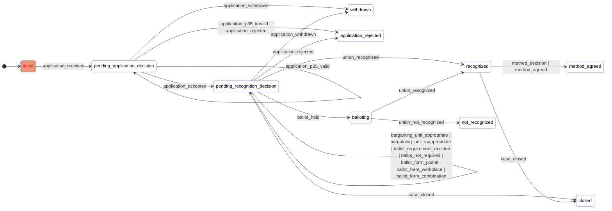

# Architecture

This project uses:

- A data pipeline running in [**Lambdas**](https://aws.amazon.com/lambda/) orchestrated by [**Step Functions**](https://aws.amazon.com/step-functions/) on [**AWS**](https://aws.amazon.com/)
- An [**OpenSearch**](https://opensearch.org/) cluster running on [**bonsai.io**](https://bonsai.io), for storing and searching the data.
- [**Gemini**](https://ai.google.dev/gemini-api) 2.5 Flash and Flash-Lite from Google AI, for extracting data from the CAC decisions.
- [**Next.js**](https://nextjs.org/) hosted on [**Vercel**](https://vercel.com/), for the web application.

It relies on [**Terraform**](https://www.terraform.io/) for cloud infrastructure management, and [**BAML**](https://boundaryml.com/) for type-safe LLM prompting and structured data extraction. The scraping is done using [**scrapy**](https://scrapy.org/). The frontend is built using [**Tailwind CSS**](https://tailwindcss.com/) and [**shadcn/ui**](https://ui.shadcn.com/) components.

It looks something like this:

BAML is really excellent for the data extraction tasks, as shown by the suite of evaluation tests that can be found in the GitHub repository. Gemini 2.5 Flash-Lite shows good performance, but the pipeline will fall back to 2.5 Flash if the LLM calls fail validation.

Once the data is extracted, it's transformed into the event-based format with a state machine for validation:

 

